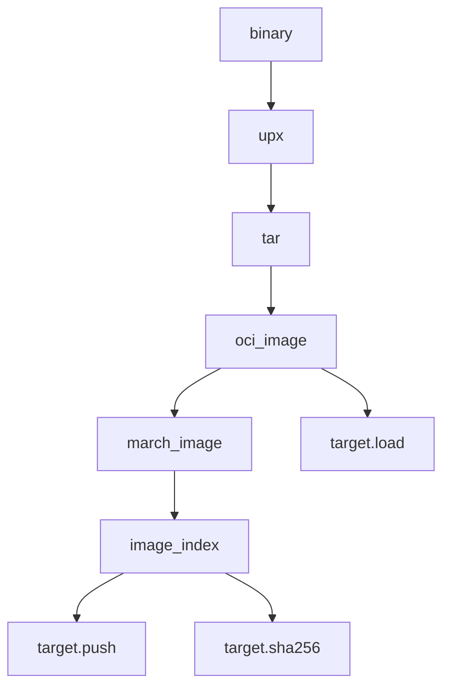

<!-- Generated with Stardoc: http://skydoc.bazel.build -->

# **Container**
Utilities for building containers.

<a id="build_image"></a>

## build_image

<pre>
load("@//libs/bazel/rules/private:container.bzl", "build_image")

build_image(<a href="#build_image-name">name</a>, <a href="#build_image-srcs">srcs</a>, <a href="#build_image-repository">repository</a>, <a href="#build_image-binary_name">binary_name</a>, <a href="#build_image-remote_tag">remote_tag</a>, <a href="#build_image-base">base</a>, <a href="#build_image-platforms">platforms</a>)
</pre>

Builds a multi-architecture OCI image and index.

#### **flow**


#### **Example**
```starlark
build_image(
    name = "my_multi_arch_image",
    base = "//infra/images/base:image",
    srcs = ["file1", "file2"],
    platforms = ["//tools/platforms:linux_amd64_musl"], # optional
    entry_point = "/my/entrypoint", # optional
)
```


**PARAMETERS**


| Name  | Description | Default Value |
| :------------- | :------------- | :------------- |
| <a id="build_image-name"></a>name |  (String). Name of the target.   |  none |
| <a id="build_image-srcs"></a>srcs |  (String). Files you wish to include in the image.   |  none |
| <a id="build_image-repository"></a>repository |  (String). The remote repository you want to use.   |  none |
| <a id="build_image-binary_name"></a>binary_name |  (String). Name of the binary that the container will run.   |  `"bin"` |
| <a id="build_image-remote_tag"></a>remote_tag |  (String). What to tag the remote image with ex :latest.   |  `"latest"` |
| <a id="build_image-base"></a>base |  (Label). The base image to use.   |  `"//infra/images/base:image"` |
| <a id="build_image-platforms"></a>platforms |  (Label). Bazel platform you wish to use.   |  `["//tools/platforms:linux_aarch64", "//tools/platforms:linux_amd64"]` |


