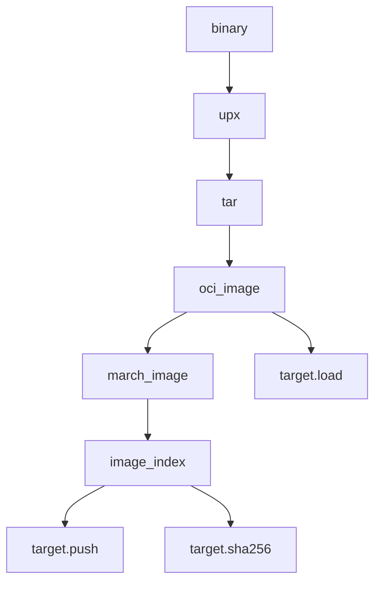

<!-- Generated with Stardoc: http://skydoc.bazel.build -->

# **Rules**
Re-exports of other files in directory for easy consumption.

<a id="cargo_deny_test"></a>

## cargo_deny_test

<pre>
load("@//libs/bazel/rules:defs.bzl", "cargo_deny_test")

cargo_deny_test(<a href="#cargo_deny_test-name">name</a>, <a href="#cargo_deny_test-srcs">srcs</a>, <a href="#cargo_deny_test-workspace">workspace</a>)
</pre>

Test `cargo_deny check`.
#### **Example**
```starlark
cargo_deny_test(
    name = "my_cargo_deny_test",
    srcs = [":Cargo.toml"],
    workspace = ":Cargo.toml",
)
```

**ATTRIBUTES**


| Name  | Description | Type | Mandatory | Default |
| :------------- | :------------- | :------------- | :------------- | :------------- |
| <a id="cargo_deny_test-name"></a>name |  A unique name for this target.   | <a href="https://bazel.build/concepts/labels#target-names">Name</a> | required |  |
| <a id="cargo_deny_test-srcs"></a>srcs |  Files you wish to include in the test.   | <a href="https://bazel.build/concepts/labels">List of labels</a> | required |  |
| <a id="cargo_deny_test-workspace"></a>workspace |  The workspace directory as a file path where Cargo.toml is located.   | <a href="https://bazel.build/concepts/labels">Label</a> | required |  |


<a id="multi_arch"></a>

## multi_arch

<pre>
load("@//libs/bazel/rules:defs.bzl", "multi_arch")

multi_arch(<a href="#multi_arch-name">name</a>, <a href="#multi_arch-image">image</a>, <a href="#multi_arch-platforms">platforms</a>)
</pre>

Transition an OCI image to support multiple architectures.
#### **Example**
```starlark
multi_arch(
    name = "my_multi_arch_image",
    image = "//path/to/image",
    platforms = ["//tools/platforms:linux_amd64", "//tools/platforms:linux_arm64"],
)
```

**ATTRIBUTES**


| Name  | Description | Type | Mandatory | Default |
| :------------- | :------------- | :------------- | :------------- | :------------- |
| <a id="multi_arch-name"></a>name |  A unique name for this target.   | <a href="https://bazel.build/concepts/labels#target-names">Name</a> | required |  |
| <a id="multi_arch-image"></a>image |  Oci image to transition.   | <a href="https://bazel.build/concepts/labels">Label</a> | optional |  `None`  |
| <a id="multi_arch-platforms"></a>platforms |  The platforms you wish to transition   | <a href="https://bazel.build/concepts/labels">List of labels</a> | optional |  `[]`  |


<a id="upx"></a>

## upx

<pre>
load("@//libs/bazel/rules:defs.bzl", "upx")

upx(<a href="#upx-name">name</a>, <a href="#upx-srcs">srcs</a>, <a href="#upx-out">out</a>)
</pre>

Compresses a set of binaries into upx packed ones.
#### **Example**
```starlark
upx(
    name = "my_upx_binary_target",
    srcs = [":binary_target"],
    out = "binary_name", # optional
)
```

**ATTRIBUTES**


| Name  | Description | Type | Mandatory | Default |
| :------------- | :------------- | :------------- | :------------- | :------------- |
| <a id="upx-name"></a>name |  A unique name for this target.   | <a href="https://bazel.build/concepts/labels#target-names">Name</a> | required |  |
| <a id="upx-srcs"></a>srcs |  Files you wish to compress.   | <a href="https://bazel.build/concepts/labels">List of labels</a> | optional |  `[]`  |
| <a id="upx-out"></a>out |  Resulting file to write. If absent, `[name]` is written.   | <a href="https://bazel.build/concepts/labels">Label</a> | optional |  `None`  |


<a id="build_image"></a>

## build_image

<pre>
load("@//libs/bazel/rules:defs.bzl", "build_image")

build_image(<a href="#build_image-name">name</a>, <a href="#build_image-srcs">srcs</a>, <a href="#build_image-repository">repository</a>, <a href="#build_image-binary_name">binary_name</a>, <a href="#build_image-remote_tag">remote_tag</a>, <a href="#build_image-base">base</a>, <a href="#build_image-platforms">platforms</a>)
</pre>

Builds a multi-architecture OCI image and index.

#### **flow**


#### **Example**
```starlark
build_image(
    name = "my_multi_arch_image",
    base = "//infra/images/base:image",
    srcs = ["file1", "file2"],
    platforms = ["//tools/platforms:linux_amd64_musl"], # optional
    entry_point = "/my/entrypoint", # optional
)
```


**PARAMETERS**


| Name  | Description | Default Value |
| :------------- | :------------- | :------------- |
| <a id="build_image-name"></a>name |  (String). Name of the target.   |  none |
| <a id="build_image-srcs"></a>srcs |  (String). Files you wish to include in the image.   |  none |
| <a id="build_image-repository"></a>repository |  (String). The remote repository you want to use.   |  none |
| <a id="build_image-binary_name"></a>binary_name |  (String). Name of the binary that the container will run.   |  `"bin"` |
| <a id="build_image-remote_tag"></a>remote_tag |  (String). What to tag the remote image with ex :latest.   |  `"latest"` |
| <a id="build_image-base"></a>base |  (Label). The base image to use.   |  `"//infra/images/base:image"` |
| <a id="build_image-platforms"></a>platforms |  (Label). Bazel platform you wish to use.   |  `["//tools/platforms:linux_aarch64", "//tools/platforms:linux_amd64"]` |


